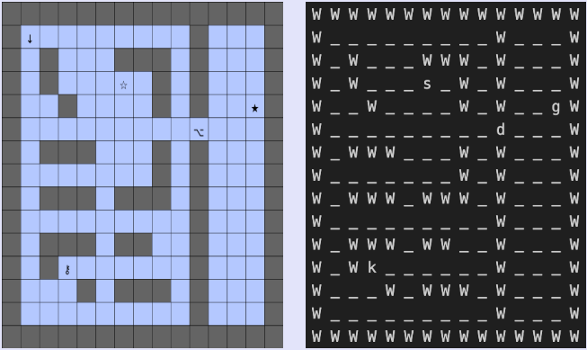

## **MDP Planning Project**

### **Project Objectives**
This project has two main objectives:  

1. **Develop a General MDP Solver**  
   - Create a solver that can handle any given MDP problem, provided it adheres to a specific format.  
<br>
2. **Formulate and Solve a Gridworld MDP**  
   - Define an MDP for a gridworld environment and compute the optimal policy.  

---

### **MDP Format**
The Markov Decision Process (MDP) is defined as follows:  

#### **States \( S \)**
- **Total number of states**: `numStates`  
- **State names**: $0, 1, \dots, \text{numStates} - 1$  

#### **Actions \( A \)**
- **Total number of actions**: `numActions`  
- **Action names**: $0, 1, \dots, \text{numActions} - 1$  

#### **Transition Function \( T \)**
- $T(s,a,s')$ → Probability of transitioning from state $s$ to state $s'$ after taking action $a$.  

#### **Reward Function \( R \)**
- $R(s,a,s')$ → Reward received for transitioning from state $s$ to state $s'$ after taking action $a$.  

#### **Discount Factor \( \gamma \)**
- $\gamma \in [0,1]$  

---

### **MDP File Format**
The MDP is stored as a text file with the following format:  

1. **Number of States**  
   ```
   numStates  [number of States]
   ```
   <br>
2. **Number of Actions**  
   ```
   numActions  [number of Actions]
   ```
   <br>
3. **Terminal States**  
   ```
   end  [terminal state 1]  [terminal state 2] ... [terminal state n]
   ```
   - If the MDP is continuous, assume the terminal state is `-1`.  <br><br>
4. **Transition Probabilities and Rewards**  
   Each line represents a transition with a non-zero probability:  
   ```
   transition  [current state]  [action]  [next state]  [reward]  [transition probability]
   ```
    <br>
5. **MDP Type**  
   ```
   mdptype  [episodic/continuing]
   ```
   <br>
6. **Discount Factor**  
   ```
   discount  [gamma value]
   ```

For more details, check the directory: `./data/mdp`

---

### **Policy File Format**
The Policy File should be of the following format-- <br>
At line \( s \):  
```
[Action from state s]
```

---

### **Solver Description**
The Solver is present in the `planner.py` executable file. To use it, enter the following in your terminal:  

```bash
python3 planner.py --mdp [mdp file] --algorithm [hpi/lp] --policy [policy file]
```

- `--mdp` takes in the file with the MDP in the format as described above.  
- `--algorithm` takes in one of two inputs: `hpi` or `lp` (the method to solve the MDP).  
- `--policy` takes in the policy file in the format as described above.  

#### **Input**
MDP file entered using the `--mdp` argument.  

#### **Process**
By default, when the policy argument is **not used**, the Solver computes the optimal policy and value function using one of the following two algorithms:  

1. **Howard Policy Iteration (HPI)**
2. **Linear Programming (LP) [default]**  

When the policy argument **is used**, it computes the **value function** under the given policy and returns it to standard output.  


#### **Output**
#### **Optimal Policy Generation (to standard output)**
At line \( s \):  
```
[optimal state value]    [optimal action]
```

#### **Policy Evaluation (to standard output)**
At line \( s \):  
```
[state value]
```

For more details, check:  

1. `planner.py`
2. `./data/mdp` (solution files)  
---

### **Icy Gridworld**



#### **Problem Statement**
There is an **icy gridworld** of dimensions **$m \times n$**. Each cell in the gridworld can be one of the following:  

- `_` → **Icy floor**  
- `W` → **Wall**  
- `s` → **Start**  
- `g` → **Goal**  
- `k` → **Key**  
- `d` → **Door**  
- `^` → **Facing Up**  
- `v` → **Facing Down**  
- `<` → **Facing Left**  
- `>` → **Facing Right**  

The **agent** is positioned in one of these cells and faces one of four directions:  

- **Up**  
- **Down**  
- **Left**  
- **Right**  

At each state, the agent can choose among the following actions:  

- `0` → **Move Forward**  
  - Moves **1, 2, or 3** steps forward (due to the icy floor) in the direction it is facing.  
- `1` → **Turn Left**  
  - Turns **left** or **turns back** from the direction it is facing without changing its cell.  
- `2` → **Turn Right**  
  - Turns **right** or **turns back** from the direction it is facing without changing its cell.  
- `3` → **Turn Around**  
  - Turns **back** or turns **left/right** while staying in the same cell.  
 
The agent cannot move into a **wall** (`W`). It starts from the **start cell** (`s`) and must reach the **goal** (`g`).


The gridworld is designed so that a **line of walls** separates the agent from the goal cell initially.  
- The only way to reach the goal is by passing through a **door** (`d`) in the wall.  
- The door is **initially locked** and requires a **key** (`k`) to open.  
- The agent **must land on the key cell** to pick up the key.  
- Once the key is obtained, the agent **keeps it until reaching the goal**.  

**Objective**:  
Find the **key**, unlock and **pass through the door**, and **reach the goal** in the **shortest possible steps**.  

---


### **Transition Probabilities**
Since the **floor is icy**, the agent can **land in multiple states** after taking an action:  

- **Choosing Action `0` (Move Forward):**  
  - If a wall is present right in front:  
    - $ P(\text{Stay}) = 1.0 $  
  - If a wall is present 2 steps away:  
    - $ P(\text{Move\ 1\ step}) = 1.0 $  
  - If a wall is present 3 steps away:  
    - $ P(\text{Move\ 1\ step}) = 0.5 $
    - $ P(\text{Move\ 2\ steps}) = 0.5 $  
  - Otherwise:  
    - $ P(\text{Move\ 1\ step}) = 0.5 $  
    - $ P(\text{Move\ 2\ steps}) = 0.3 $  
    - $ P(\text{Move\ 3\ steps}) = 0.2 $
    <br>
    <br>
- **Choosing Action `1` (Turn Left):**  
  - $ P(\text{Left\ Turn}) = 0.9 $  
  - $ P(\text{Turn\ Back}) = 0.1 $  

- **Choosing Action `2` (Turn Right):**  
  - $ P(\text{Right\ Turn}) = 0.9 $  
  - $ P(\text{Turn\ Back}) = 0.1 $  

- **Choosing Action `3` (Turn Around):**  
  - $ P(\text{Turn\ Back}) = 0.8 $  
  - $ P(\text{Left\ Turn}) = 0.1 $  
  - $ P(\text{Right\ Turn}) = 0.1 $  


---


### **MDP Formulation**
#### **States**
Each state is represented as **$(i, j, d, k)$**:  

- **$i$** → Row number ( $0 \leq i < m$ )  
- **$j$** → Column number ( $0 \leq j < n$ )  
- **$d$** → Direction the agent is facing ( $0 \leq d < 4$ )  
- **$k$** → Whether the agent has the key or not ( $0 \leq k < 2$ )  

$
k =
\begin{cases} 
1, & \text{if the agent has the key} \\
0, & \text{otherwise}
\end{cases}
$

$
d =
\begin{cases} 
0, & \text{Facing Up} \\
1, & \text{Facing Left} \\
2, & \text{Facing Down} \\
3, & \text{Facing Right}
\end{cases}
$

#### **Reward Function**
- **All states** have a reward of `-1` to encourage the agent to reach the goal as quickly as possible.  


#### **Discount Factor**
$\gamma = 1$
- **Modeled as an episodic task**.  

---

### **MDP Encoding**
To **formulate the MDP** for your gridworld, use the `encoder.py` file:  

```bash
python3 encoder.py --gridworld [gridworld file]
```

📂 **Check** `./data/gridworld/` for details on the gridworld file format.  

**Output**:  
Returns the **MDP** in the format described above.  

---

### **Using the Optimal Policy**
Use `decoder.py` to find the optimal action from any given state:  

```bash
python3 decoder.py --mdp [mdp file] --value-policy [output file of planner.py] --gridworld [test gridworld file]
```

📂 **Check** `./data/test/` for details on the test file format.  

🔹 **Note:** If the agent already **owns the key** in the test gridworld, the **key will not be visible** in the grid.  

**Output**:  
Displays the **optimal action** from the given state in the test gridworld.  

---

### **Source**
> *The problem statement is adapted from **Assignment 2** of the course*  
> ***CS747: Foundations of Intelligent and Learning Agents***  
> *taught at IIT Bombay by Professor Shivaram Kalyanakrishnan.*

